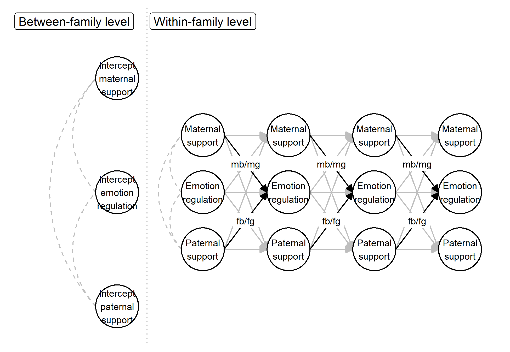

```{r setup, include = FALSE}
library("papaja")
library("worcs")
# We recommend that you prepare your raw data for analysis in 'prepare_data.R',
# and end that file with either open_data(yourdata), or closed_data(yourdata).
# Then, uncomment the line below to load the original or synthetic data
# (whichever is available), to allow anyone to reproduce your code:
# load_data()
```

This vignette accompanies the paper *"A Review of Applications of the Bayes Factor in Psychological Research"*, and illustrates how to evaluate informative hypotheses about
parameters in structural equation models.
Informative hypotheses are relevant when a traditional null hypothesis does
not represent researchers' actual expectations.
We re-analyze data from a published 4-year longitudinal study on
the associations between parenting behaviors and adolescents'
dispositional emotion regulation
[@vanlissaRoleFathersMothers2019], of which a preprint is available at https://psyarxiv.com/fkh5q/.
Notably, this study revolved around informative hypotheses that were not evaluated
directly; instead, null hypotheses were tested.
This study used a
random-intercept cross-lagged panel model (RI-CLPM),
which is a sophisticated longitudinal structural equation model.
The RI-CLPM controls for stable between-family differences in the variables studied,
to more accurately estimate within-family cross-lagged effects
[@hamakerCritiqueCrosslaggedPanel2015].
Our hypotheses focus on regression coefficients in this RI-CLPM.

The original study investigated differences between mothers' and fathers' parenting of
male and female adolescents.
Although the original paper investigated adolescent- and parent-reported support,
behavioral-, and psychological control -
this vignette focuses only on adolescent-reported support.

## Data

We used four annual waves of a longitudinal study on 480 Dutch adolescents (from age 15-18).
Adolescents reported on perceived maternal- and paternal support using an 8-item Support
questionnaire from the Network of Relationships Inventory
[@furmanChildrenPerceptionsPersonal1985],
and on emotion regulation using 32 items of the reverse-coded
Difficulties in Emotion Regulation Scale [@gratzMultidimensionalAssessmentEmotion2004].
Cronbach's $\alpha$ for these scales ranged from .83-.95.
The results below were estimated on the original data, which are privacy sensitive.
We use the *Workflow for Open Reproducible Code in Science*, implemented in the
`worcs` R-package [@vanlissaWORCSWorkflowOpen2020],
to provide fully reproducible code with an automatically generated synthetic dataset. 
This synthetic dataset will yield different results from the original data.
All code and the synthetic data are available at https://github.com/cjvanlissa/IHBT-SEM.

## Model

```{r, echo = FALSE, warning=FALSE, message=FALSE}
library(tidySEM)
library(bain)
library(lavaan)

# Load sem syntax
source("model_syntax.R")

# Read the data
tmp <- capture.output(load_data())

# Run the SEM-analysis
model <- sem(syntax, data = df, missing = "fiml", group = "sex")

# Inspect model fit
ft <- fitmeasures(model, fit.measures = c("chisq", "df", "rmsea", "cfi", "tli"))
# Evaluate informative hypotheses
res <- bain(model, "(mg, mb, fb, fg) > 0;
             (mg, mb) > (fb, fg);
             mg > mb;
             (mg, mb, fb, fg) > 0 & (mg, mb) > (fb, fg) & mg > mb")
```

Using the code below, we estimated a dual-group random-intercept cross-lagged panel model
for boys and girls separately.
Cross-lagged coefficients were constrained across time.
The full model specification is provided in the file `model_syntax.R`.

```{r, eval = FALSE, echo = TRUE}
# Load libraries
library(bain)
library(lavaan)

# Load sem syntax
source("model_syntax.R")

# Read the data
load_data()

# Run the SEM-analysis
# Note that, use of missing = "fiml" is only valid if
# hypotheses in bain are formulated using ">" and "<",
# and not (additionally) using "=".
# See the bain vignette for more information.
model <- sem(syntax, data = df, missing = "fiml", group = "sex")

# Inspect model fit
fitmeasures(model, fit.measures = c("chisq", "df", "rmsea", "cfi", "tli"))
```

Figure \@ref(fig:f1) shows a simplified diagram of the model,
with the parameters of interest labelled.
The original paper offers a complete technical diagram of the RI-CLPM. 
This model fit the data well;
$\chi^2(90) `r report(ft["chisq"])`$, RMSEA $`r report(ft["rmsea"])`$, CLI $`r report(ft["cfi"])`$, TLI $`r report(ft["tli"])`$.
Using the command `summary(model, ci = TRUE)`, we can obtain a table of model coefficients (see Table \@ref(tab:t1)).
For this vignette, we will use the unstandardized regression coefficients,
which are comparable because maternal and parental support
were measured along the same scale.

```{r f1, fig.cap="Simplified model diagram. Labels m and f refer to effects of mothers and fathers, respectively, and b and g refer to effects on boys and girls, respectively.", message=FALSE, warning=FALSE}
source("figure1.R")

```
```{r t1, results = "asis"}
tab <- table_results(model, columns = NULL)
tab <- tab[grepl("^cde2", tab$lhs) & tab$op == "~" & grepl("^ca.sup1", tab$rhs), c("rhs", "group", "est_sig", "confint")]
tab$Label <- tab$Parameter <- tolower(paste0(tab$rhs, " on ", tab$group))
tab$Parameter <- gsub("camsup1", "Mother", tab$Parameter)
tab$Parameter <- gsub("cafsup1", "Father", tab$Parameter)
tab$Label <- gsub("ca(.)sup1", "\\1", tab$Label)
tab$Label <- gsub(" on (.).*$", "\\1", tab$Label)
tab$Estimate <- tab$est_sig
tab[["95% CI"]] <- tab$confint
apa_table(tab[, c('Parameter', "Label", "Estimate", "95% CI")], note = "*: p < .05", caption = "Model parameters used to evaluate the informative hypotheses")
```

## Hypotheses

The original paper introduced the following informative hypotheses:

> *We expected parental support to be positively associated with adolescents' emotion regulation. We hypothesized these links to be stronger for mothers than for fathers. We further expected to find stronger associations between support and emotion regulation between mothers and daughters than between mothers and sons.*

If $\beta$ refers to a regression coefficient, $_{m}$ and $_f$ refer to the effects of mothers and fathers, respectively, and $_b$ and $_g$ refer to effects on boys and girls, respectively, then these hypotheses can be written as:

$$
\begin{aligned}
 H_1:& (\beta_{mg}, \beta_{mb}, \beta_{fb}, \beta_{fg}) > 0\\
H_2:& (\beta_{mg}, \beta_{mb}) > (\beta_{fb}, \beta_{fg})\\
H_3:& \beta_{mg} > \beta_{mb}\\
H_4:& (\beta_{mg}, \beta_{mb}, \beta_{fb}, \beta_{fg}) > 0 \:\&\: (\beta_{mg}, \beta_{mb}) > (\beta_{fb}, \beta_{fg}) \:\&\: \beta_{mg} > \beta_{mb}
\end{aligned}
$$

Note that the fourth hypothesis is an omnibus test of the preceding three hypotheses;
$H_4: H_1 \& H_2 \& H_3$.
See Figure \@ref(fig:f1) for a visual representation of the model,
with the parameters of interest labelled. 
We can evaluate these hypotheses by calling the `bain()` function on the
`lavaan` model object, and specifying the hypotheses as a text string.
The results of this call are displayed in Table \@ref(tab:res).

```{r res, echo = FALSE, eval = TRUE, message=FALSE, warning=FALSE, results = "asis"}
apa_table(res$fit[, c("Fit", "Com", "BF.u", "BF.c", "PMPa", "PMPb")], format.args = list(na_string = ""), caption = "Main output of the call to bain")
```
```{r, eval = FALSE, echo = TRUE, message=FALSE, warning=FALSE, results = "none"}
# Evaluate informative hypotheses
bain(model, "(mg, mb, fb, fg) > 0;
             (mg, mb) > (fb, fg);
             mg > mb;
             (mg, mb, fb, fg) > 0 & (mg, mb) > (fb, fg) & mg > mb")
```

<!--%We computed Bayes factors for each of these informative hypotheses against the complementary alternative hypothesis that any other ordering of parameters was true, $H_c: !H_i$. In this tutorial, we will compute the same Bayes factors for each conflict behavior, and one omnibus Bayes factor for all behaviors.-->

## Results

In the original paper, the results were reported as follows:

> *[...] we found predictive effects between emotion regulation and adolescent-perceived maternal support, but not paternal support. In line with our hypothesis that these effects would be strongest between mothers and daughters, perceived maternal support positively predicted girls', but not boys', emotion regulation $\chi^2(1) = 8.60, p = .003$.*

Note that this does not constitute a formal test of the original four hypotheses. 
Instead, several null hypothesis tests are used to conclude that effects are present for
maternal support, but absent for paternal support.
Moreover, a chi-squared test is reported for the difference between the maternal effect on boys versus girls.

Using the `bain` R-package [@gu2019bain], we can directly evaluate the informative hypotheses.
This is more suitable than the indirect approach used in the original paper.
First, we evaluate Bayes factors for each informative hypothesis $H_i$,
which reflect support in the data in favor of $H_i$,
relative to the complement of that hypothesis, which states that any other ordering of parameters is true, $H_c: !H_i$.
Table \@ref(tab:res) indicates that, for $H_1$, the Bayes factor was BF$_1 `r report(res$fit$BF.c[1])`$, indicating no evidence for or against the hypothesis that parents' support positively predicts emotion regulation.
BF$_2 `r report(res$fit$BF.c[2])`$ indicated limited evidence in favor of $H_2$ over its complement.
Thus, the data provided approximately three times more evidence for the hypothesis that maternal support predicts emotion regulation more strongly than paternal support,
than for any ordering of parameters.
BF$_3 `r report(res$fit$BF.c[3])`$ indicated substantial evidence in favor of $H_3$ over its complement.
Thus, the effect of maternal support on emotion regulation is very likely stronger for girls than boys.
Overall, there was limited evidence in favor of the combination of these three hypotheses, relative to their complement, BF$_4 `r report(res$fit$BF.c[4])`$.
Thus, evidence in favor of all three hypotheses was about three times as large as evidence against them.

Finally, we can compare posterior model probabilities, which indicate the degree of preference for all four hypotheses in the set,
and for an unconstrained hypothesis, $H_u$.
This unconstrained hypothesis places no restrictions on the model parameters,
and will thus be preferred if none of the constraints imposed by the informative hypotheses are well-supported by the data.
Based on posterior model probabilities, support was strongest for $H_4$, $p_4 = .34$,
followed by $H_2$, $p_2 = .24$, $H_3$, $p_3 = .20$, $H_1$, $p_1 = .12$,
and finally $H_u$, $p_u < .11$.
Thus, despite its relatively small Bayes factor, the omnibus hypothesis received most support.
However, a preference for $H_4$ implies a Bayesian error probability of 1 - .34 = .66.
This is a substantial error probability.

## Discussion

We observe that no hypothesis is strongly preferred over the unconstrained hypothesis, and that only $H_3$ is strongly preferred over its complement (indeed, the estimate $\beta_{mg} = .18$, whereas $\beta_{mb} = .01$). If we select $H_4$, our complex informative hypothesis, the $PMP_b = `r report(res$fit$PMPb[4], equals = F)`$, so the Bayesian error probability is $1-PMP_{b} = `r report(1-res$fit$PMPb[4], equals = F)`$ - about 70% probability that we have selected the wrong model. In other words - support for the original hypotheses is relatively inconclusive. The only finding convincingly supported is that maternal support predicts girls', but not boys', emotion regulation.

## Key References and Software

This vignette demonstrates how to evaluate informative hypotheses about parameters in structural equation models using the Bayes Factor. For more information about Bayesian informative hypothesis evaluation, please see the general tutorial by @hoijtinkTutorialTestingHypotheses2019a, and the tutorial focused specifically on informative hypotheses for structural equation models by @vanlissaTeacherCornerEvaluating2020. The present vignette uses the `bain` R-package [@gu2019bain], which can evaluate informative hypotheses about structural equation models estimated in `lavaan` [@rosseel2012lavaan] as of version 0.2.3. This vignette is made fully reproducible using the `worcs` R-package [@vanlissaWORCSWorkflowOpen2020], and results are reported using the `tidySEM` R-package [@vanlissa2020tidysem].

\newpage

```{r create_r-references}
r_refs(file = "r-references.bib")
```

\begingroup
\setlength{\parindent}{-0.5in}
\setlength{\leftskip}{0.5in}

<div id="refs" custom-style="Bibliography"></div>
\endgroup
